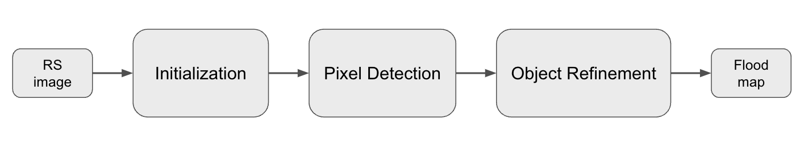

# SWD: Self-supervised Waterbody Detection

## 1 Theory
SWD is a framework that transforms supervised classification into an automated tool for remote sensing-based surface water detection(Figure 1).

**Figure 1. SWD framework**

Paper regarding the SWD application on multi-source remote sensing flood mapping system: https://ieeexplore.ieee.org/document/10641791.

## 2 Code for application on PlanetScope images, v1.1.0.
One example of SWD practical code for floodwater detection using PlanetScope image.
Input PlanetScope data, https://www.planet.com/ 
1. The code automatically pulls ancillary data, i.e., ESA water occurrence.
2. The initial sample is automatically generated based on persistent water occurrence and cleaned by global adaptive thresholding with a split-based approach.
3. The pixel classification model is gaussian mixture model(GMM).

## 3 Requirements
```
conda install gdal shapely rasterio scipy dask scikit-learn scikit-image jupyter -c conda-forge
```

## 4 Usage
Clone or download this repository then:
### Option 1: run in terminal
```
python -u SWD.py input_4bands_image_path input_udm2_path output_file_path
```
Args:
1. input_4bands_image_path: input image file path, currently using the option of 'Surface reflectance - 4 band'.
2. input_udm2_path: Planet Usable Data Masks. SWD now use the band 0 in udm2 file to mask out invalid pixels. https://developers.planet.com/docs/data/udm-2/
3. output_file_path: output flood inundation mask file path.

Template:
```
python -u /shared/stormcenter/Qing_Y/quick_functions/SWD/SWD.py \
/shared/Planet_SWD/raw_data/RR_05102023_psscene/composite.tif \
/shared/Planet_SWD/raw_data/RR_05102023_psscene/composite_udm2.tif \
/shared/Planet_SWD/SWD_single_GMM/RR_05102023_psscene/RR_05102023_psscene_SBA_GMM_25.tif
```

### Option 2: run in python
```
import sys
sys.path.insert(0, 'PATH_TO_SWD_FOLDER')
from SWD import *

SWD(input_4bands_image_path,input_udm2_path,output_file_path)
```